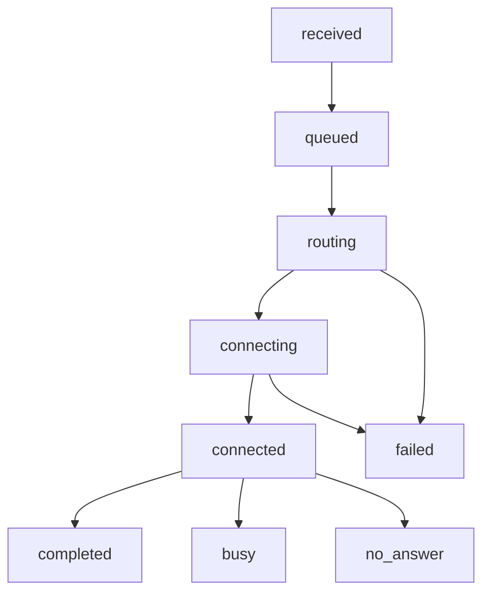

# Cloudonix Voice Application Tool - Product Specification

## System Architecture Overview

### Control Plane (MySQL - Durable Truth)

The control plane manages all persistent configuration and historical data using MySQL with automatic tenant scoping. All tables include `tenant_id` foreign keys and leverage Laravel's global scopes for automatic isolation.

#### Core Tables

**tenants**
- `id` (Primary Key)
- `name` (String, 255)
- `domain` (String, 255, Unique)
- `settings` (JSON)
- `created_at`, `updated_at`

**users**
- `id` (Primary Key)
- `tenant_id` (Foreign Key)
- `name` (String, 255)
- `email` (String, 255, Unique)
- `password` (String, Hashed)
- `role` (Enum: admin, analyst)
- `created_at`, `updated_at`

**voice_agents**
- `id` (Primary Key)
- `tenant_id` (Foreign Key)
- `name` (String, 255)
- `provider` (Enum: synthflow, dasha, etc.)
- `service_value` (String, 500, Encrypted)
- `username` (String, 255, Nullable, Encrypted)
- `password` (String, 255, Nullable, Encrypted)
- `enabled` (Boolean, Default: true)
- `metadata` (JSON, Nullable)
- `created_at`, `updated_at`

**agent_groups**
- `id` (Primary Key)
- `tenant_id` (Foreign Key)
- `name` (String, 255)
- `strategy` (Enum: load_balanced, priority, round_robin)
- `settings` (JSON) - Strategy-specific configuration
- `created_at`, `updated_at`

**agent_group_memberships**
- `id` (Primary Key)
- `group_id` (Foreign Key)
- `agent_id` (Foreign Key)
- `priority` (Integer, Nullable) - For priority strategy ordering
- `capacity` (Integer, Default: 1) - Relative capacity weight
- `created_at`, `updated_at`

**inbound_routing_rules**
- `id` (Primary Key)
- `tenant_id` (Foreign Key)
- `pattern` (String, 255) - Phone number or prefix pattern
- `target_type` (Enum: agent, group)
- `target_id` (Foreign Key)
- `priority` (Integer)
- `enabled` (Boolean, Default: true)
- `created_at`, `updated_at`

**outbound_routing_rules**
- `id` (Primary Key)
- `tenant_id` (Foreign Key)
- `caller_id` (String, 255) - Outbound caller ID pattern
- `destination_pattern` (String, 255) - Prefix/country pattern
- `trunk_config` (JSON) - Cloudonix trunk selection rules
- `enabled` (Boolean, Default: true)
- `created_at`, `updated_at`

**call_records**
- `id` (Primary Key)
- `tenant_id` (Foreign Key)
- `session_token` (String, 255)
- `direction` (Enum: inbound, outbound)
- `from_number` (String, 50)
- `to_number` (String, 50)
- `agent_id` (Foreign Key, Nullable)
- `group_id` (Foreign Key, Nullable)
- `status` (Enum: queued, ringing, in_progress, completed, busy, failed, no_answer)
- `start_time` (Timestamp)
- `end_time` (Timestamp, Nullable)
- `duration` (Integer, Nullable) - Seconds
- `created_at`, `updated_at`

**webhook_audit**
- `id` (Primary Key)
- `tenant_id` (Foreign Key)
- `event_type` (String, 100)
- `session_token` (String, 255)
- `payload` (JSON)
- `processed_at` (Timestamp)
- `created_at`

### Execution Plane (Redis - Ephemeral State)

The execution plane manages runtime state, distributed locks, and real-time event broadcasting using Redis.

#### Key Patterns

**Load Balancing Memory**
```
Key: tenant:{tenant_id}:group:{group_id}:load_balanced:calls
Type: Sorted Set
Members: agent_id (score: call count in rolling window)

Key: tenant:{tenant_id}:group:{group_id}:load_balanced:window
Type: Sorted Set
Members: timestamp:agent_id (score: unix timestamp)
```

**Round Robin Pointers**
```
Key: tenant:{tenant_id}:group:{group_id}:round_robin:current
Type: String
Value: current agent_id in rotation
```

**Distributed Locks**
```
Key: tenant:{tenant_id}:routing:lock:{session_token}
Type: String (SET with NX EX options)
Value: lock holder identifier
```

**State Machine State**
```
Key: tenant:{tenant_id}:session:{session_token}:state
Type: Hash
Fields: current_state, start_time, agent_id, group_id, metadata
```

**Idempotency Keys**
```
Key: tenant:{tenant_id}:webhook:idempotent:{event_type}:{session_token}:{event_id}
Type: String
Value: processing_status (TTL: 24 hours)
```

**Real-Time Event Broadcasting**
```
Channel: tenant:{tenant_id}:events
Message Format: JSON with event_type, data, timestamp

Event Types:
- call_started: {session_token, agent_id, group_id}
- call_completed: {session_token, duration, status}
- agent_status_changed: {agent_id, enabled}
- metrics_updated: {calls_today, success_rate}
```

### Integration Architecture

#### Cloudonix Webhook Processing
**Endpoint**: `POST /api/voice/application/{tenant_domain}`
**Authentication**: Bearer token validation + domain verification
**Idempotency**: Redis-based duplicate prevention with 24-hour TTL
**State Machine**: Session-based call lifecycle management
**Response**: CXML generation compliant with Cloudonix specifications

#### CXML Generation Templates

**Voice Agent Routing**:
```xml
<?xml version="1.0" encoding="UTF-8"?>
<Response>
  <Dial callerId="{caller_id}" action="{callback_url}" method="POST">
    <Service provider="{provider}">
      {service_value}
    </Service>
  </Dial>
</Response>
```

**Outbound Trunk Routing**:
```xml
<?xml version="1.0" encoding="UTF-8"?>
<Response>
  <Dial trunks="{trunk_ids}" callerId="{caller_id}" action="{callback_url}" method="POST">
    <Number>{destination_number}</Number>
  </Dial>
</Response>
```

**Hang-up Response**:
```xml
<?xml version="1.0" encoding="UTF-8"?>
<Response>
  <Hangup/>
</Response>
```

### Technology Stack Details

**Backend**: Laravel 11+ with PHP 8.2+
**Frontend**: React 18+ with TypeScript 5+
**Database**: MySQL 8.0+ with InnoDB engine
**Cache/Queues**: Redis 7+ with clustering support
**Real-Time**: WebSocket/SSE with Redis pub/sub
**Storage**: MinIO with S3-compatible API
**Containerization**: Docker Compose with health checks

## API Specifications

### Authentication Endpoints

#### POST /api/auth/login
**Request Body**:
```json
{
  "email": "admin@tenant.com",
  "password": "password"
}
```

**Response** (200):
```json
{
  "user": {
    "id": 1,
    "name": "Admin User",
    "email": "admin@tenant.com",
    "role": "admin"
  },
  "token": "bearer_token_here"
}
```

**Error Responses**:
- 401: Invalid credentials
- 422: Validation errors

#### POST /api/auth/refresh
**Headers**: Authorization: Bearer {token}
**Response**: New token with extended expiration

### Voice Agent Management APIs

#### GET /api/voice-agents
**Query Parameters**: page, per_page, search, enabled
**Response** (200):
```json
{
  "data": [
    {
      "id": 1,
      "name": "Support Agent 1",
      "provider": "synthflow",
      "enabled": true,
      "metadata": {"region": "us-east"},
      "created_at": "2024-01-01T00:00:00Z"
    }
  ],
  "meta": {
    "current_page": 1,
    "per_page": 20,
    "total": 1
  }
}
```

#### POST /api/voice-agents
**Request Body**:
```json
{
  "name": "New Agent",
  "provider": "vapi",
  "service_value": "agent_12345",
  "metadata": {"tags": ["support", "english"]}
}
```

**Response** (201): Created agent object

#### PUT /api/voice-agents/{id}
**Request Body**: Same as POST with optional fields
**Response** (200): Updated agent object

#### DELETE /api/voice-agents/{id}
**Response** (204): No content

#### PATCH /api/voice-agents/{id}/toggle
**Response** (200): Updated agent with new enabled status

### Agents Group Management APIs

#### GET /api/agent-groups
**Response**: Paginated list of groups with member counts

#### POST /api/agent-groups
**Request Body**:
```json
{
  "name": "Support Team",
  "strategy": "load_balanced",
  "settings": {
    "window_hours": 24,
    "fallback_enabled": true
  }
}
```

#### POST /api/agent-groups/{id}/members
**Request Body**:
```json
{
  "agent_id": 1,
  "priority": 1,
  "capacity": 2
}
```

#### PUT /api/agent-groups/{id}/members/{membership_id}
**Request Body**: Updated membership data

### Routing Rule APIs

#### GET /api/inbound-routing-rules
**Response**: Ordered list of rules by priority

#### POST /api/inbound-routing-rules
**Request Body**:
```json
{
  "pattern": "+1234567890",
  "target_type": "group",
  "target_id": 1,
  "priority": 1
}
```

#### PUT /api/inbound-routing-rules/{id}
**Request Body**: Updated rule data

#### POST /api/inbound-routing-rules/reorder
**Request Body**: Array of rule IDs in new priority order

### Analytics APIs

#### GET /api/analytics/metrics
**Query Parameters**: start_date, end_date, agent_id, group_id
**Response**:
```json
{
  "calls_today": 150,
  "success_rate": 0.95,
  "avg_duration": 180,
  "active_calls": 3,
  "trends": [
    {"date": "2024-01-01", "calls": 120, "success_rate": 0.94}
  ]
}
```

#### GET /api/analytics/call-records
**Query Parameters**: page, per_page, filters
**Response**: Paginated call records with filtering

#### POST /api/analytics/export
**Request Body**:
```json
{
  "format": "csv",
  "filters": {"start_date": "2024-01-01", "agent_id": 1},
  "fields": ["session_token", "from_number", "status", "duration"]
}
```

**Response** (202): Export job initiated, returns job ID

#### GET /api/analytics/export/{job_id}/status
**Response**: Export completion status and download URL

### Voice Application Webhook Endpoints

#### POST /api/voice/application/{domain}
**Headers**:
- X-CX-APIKey: Application API key
- X-CX-Domain: Cloudonix domain

**Request Body** (Voice Application Request):
```json
{
  "CallSid": "session_123",
  "From": "+1234567890",
  "To": "+0987654321",
  "Direction": "inbound",
  "Session": "session_token",
  "Domain": "tenant.cloudonix.com"
}
```

**Response** (200): CXML routing response

#### POST /api/voice/session/update/{domain}
**Request Body**: Call status update with DialCallStatus, etc.
**Response** (200): Acknowledgment

#### POST /api/voice/session/cdr/{domain}
**Request Body**: Complete call detail record
**Response** (200): CDR stored successfully

## Real-Time Architecture

### WebSocket/SSE Implementation

**Connection Endpoint**: `/ws/realtime?token={auth_token}`

**Client Subscription**:
```javascript
const ws = new WebSocket('/ws/realtime?token=abc123');

// Subscribe to tenant events
ws.send(JSON.stringify({
  action: 'subscribe',
  channels: ['tenant:events', 'tenant:metrics']
}));
```

**Event Message Format**:
```json
{
  "channel": "tenant:events",
  "event": "call_started",
  "data": {
    "session_token": "session_123",
    "agent_id": 1,
    "group_id": null,
    "timestamp": "2024-01-01T12:00:00Z"
  }
}
```

### Redis Pub/Sub Architecture

**Publisher Service** (Laravel Events):
```php
// In routing service after decision
event(new CallRoutedEvent($callData));

// Event listener publishes to Redis
Redis::publish("tenant:{$tenantId}:events", json_encode($eventData));
```

**Subscriber Service** (WebSocket Server):
```javascript
// WebSocket server subscribes to Redis channels
redis.subscribe(`tenant:${tenantId}:events`);

// Forward messages to connected clients
redis.on('message', (channel, message) => {
  ws.send(message);
});
```

### Event Schema Definitions

**Call Events**:
- `call_queued`: New call entered system
- `call_routed`: Routing decision made
- `call_connected`: Call successfully connected to agent
- `call_completed`: Call ended with final status
- `call_failed`: Call failed with error details

**Agent Events**:
- `agent_enabled`: Agent activated for routing
- `agent_disabled`: Agent deactivated
- `agent_status_changed`: Real-time status update

**System Events**:
- `metrics_updated`: Dashboard metrics refreshed
- `rule_changed`: Routing rule modified
- `group_updated`: Agent group configuration changed

### Connection Management

**Authentication**: JWT token validation on WebSocket upgrade
**Tenant Isolation**: Channel scoping prevents cross-tenant data leakage
**Backpressure**: Message queuing with configurable buffer limits
**Reconnection**: Automatic client reconnection with message replay
**Health Monitoring**: Connection status and message throughput metrics

## State Machine Design

### Call Lifecycle States



**State Definitions**:
- `received`: Initial webhook processed
- `queued`: Call queued for routing decision
- `routing`: Routing algorithm executing
- `connecting`: Dial initiated to agent
- `connected`: Call successfully connected
- `completed`: Call ended normally
- `failed`: Routing or connection failed
- `busy`: Agent returned busy signal
- `no_answer`: Agent didn't answer

### Transition Rules

**Valid Transitions**:
- received → queued (automatic)
- queued → routing (worker pickup)
- routing → connecting (agent selected)
- connecting → connected (dial successful)
- connected → completed (normal hangup)
- Any state → failed (error conditions)

**Invalid Transitions Blocked**:
- completed → connected (prevent double processing)
- failed → connected (terminal state enforcement)

### Idempotency Implementation

**Webhook Processing**:
```php
$idempotencyKey = "webhook:{$eventType}:{$sessionToken}:{$eventId}";
$lock = Redis::set($idempotencyKey, 'processing', 'NX', 'EX', 300);

if (!$lock) {
    // Duplicate request detected
    return response()->json(['status' => 'duplicate']);
}

// Process webhook
// ... processing logic ...

Redis::setex($idempotencyKey, 86400, 'completed');
```

**Session State Locking**:
```php
$lockKey = "session:{$sessionToken}:lock";
$lockAcquired = Redis::set($lockKey, $workerId, 'NX', 'EX', 30);

if ($lockAcquired) {
    try {
        // Process state transition
        $this->updateCallState($sessionToken, $newState);
    } finally {
        Redis::del($lockKey);
    }
}
```

### Race Condition Prevention

**Distributed Routing Decisions**:
```php
$lockKey = "routing:{$groupId}:decision";
$lock = Redis::set($lockKey, $requestId, 'NX', 'EX', 5);

if ($lock) {
    $agent = $this->selectAgentForGroup($groupId);
    $this->recordRoutingDecision($agent);
    Redis::del($lockKey);
    return $agent;
}

// Lock contention - retry with backoff
return null;
```

## Security & Compliance

### Threat Model

**Cross-Tenant Data Leakage**
- **Risk**: Unauthorized access to other tenant's voice agents/routing rules
- **Mitigation**: Database-level tenant scoping, API middleware validation
- **Verification**: Automated tests for tenant isolation

**Webhook Replay Attacks**
- **Risk**: Malicious replay of webhook requests
- **Mitigation**: Idempotency keys with short TTL, session token validation
- **Verification**: Security audit of webhook processing logic

**Provider Credential Exposure**
- **Risk**: AI provider credentials leaked in logs or responses
- **Mitigation**: Encrypted storage, masked logging, secure API transmission
- **Verification**: Credential scanning and audit logging review

**API Abuse**
- **Risk**: Excessive API calls exhausting resources
- **Mitigation**: Rate limiting, request validation, monitoring
- **Verification**: Load testing and abuse scenario testing

### RBAC Implementation

**Role Definitions**:
```php
enum UserRole: string {
    case ADMIN = 'admin';      // Full CRUD access
    case ANALYST = 'analyst';  // Read-only analytics + exports
}
```

**Permission Matrix**:
| Resource | Admin | Analyst |
|----------|-------|---------|
| Voice Agents | CRUD | Read |
| Agent Groups | CRUD | Read |
| Routing Rules | CRUD | Read |
| Call Records | CRUD | Read |
| Analytics | Full | Full |
| System Config | Full | None |

**Policy Enforcement**:
```php
class VoiceAgentPolicy
{
    public function view(User $user, VoiceAgent $agent): bool
    {
        return $user->tenant_id === $agent->tenant_id;
    }

    public function update(User $user, VoiceAgent $agent): bool
    {
        return $user->role === UserRole::ADMIN 
            && $user->tenant_id === $agent->tenant_id;
    }
}
```

### Webhook Security

**Request Validation**:
```php
// Validate Cloudonix domain
$domain = $request->header('X-CX-Domain');
$tenant = Tenant::where('domain', $domain)->firstOrFail();

// Validate API key scope
$apiKey = $request->header('X-CX-APIKey');
// Verify key belongs to tenant and has voice application scope

// Validate session token format
$sessionToken = $request->input('Session');
// Ensure proper format and not expired
```

**Signature Verification** (if supported by Cloudonix):
```php
$signature = $request->header('X-CX-Signature');
$payload = $request->getContent();
$expectedSignature = hash_hmac('sha256', $payload, $webhookSecret);

if (!hash_equals($expectedSignature, $signature)) {
    throw new SecurityException('Invalid webhook signature');
}
```

### Data Protection

**Encryption at Rest**:
- Provider credentials: AES-256 encryption with tenant-specific keys
- Sensitive call data: Database-level encryption for PII fields
- Audit logs: Encrypted storage with access controls

**Encryption in Transit**:
- HTTPS mandatory for all API communications
- WebSocket connections with TLS encryption
- Database connections with SSL certificates

**Audit Logging**:
- All configuration changes logged with user context
- Webhook processing events tracked for debugging
- Failed authentication attempts monitored
- Data export activities audited

## Performance & Scalability

### Response Time Targets

**Routing Decisions**: <500ms end-to-end
- Pattern matching: <50ms
- Database queries: <100ms
- Algorithm execution: <100ms
- CXML generation: <50ms

**API Responses**:
- CRUD operations: <100ms
- Analytics queries: <200ms
- Export initiation: <500ms

**Real-Time Updates**:
- WebSocket message delivery: <100ms
- Dashboard metric calculation: <200ms
- Client-side rendering: <50ms

### Concurrency Requirements

**Routing Operations**: 100+ simultaneous decisions
- Redis locking prevents race conditions
- Database connection pooling handles load
- Queue-based processing for peak traffic

**User Sessions**: 50+ concurrent admin users
- Stateless API design supports horizontal scaling
- Session state in Redis enables load balancing
- Real-time connections managed per server instance

### Data Volume Handling

**Call Records**: 100k+ records with efficient querying
- Composite indexes on common filter combinations
- Partitioning by date for large datasets
- Archive strategy for historical data

**Real-Time Metrics**: Sub-second aggregation
- Pre-calculated metrics in Redis
- Incremental updates for performance
- Materialized views for complex aggregations

### Caching Strategy

**Application Cache** (Redis):
- User permissions: 1 hour TTL
- Routing rules: 5 minute TTL
- Agent configurations: 10 minute TTL

**Database Query Cache**:
- Analytics aggregations: 1 minute TTL
- Lookup tables: 1 hour TTL

**CDN Integration** (Future):
- Static assets served via CDN
- Public analytics data cached at edge

## Sources

### Cloudonix Documentation
- Voice Application Request: https://developers.cloudonix.com/Documentation/voiceApplication/Request
- Voice Application Response: https://developers.cloudonix.com/Documentation/voiceApplication/Operations
- CXML Syntax: https://developers.cloudonix.com/Documentation/voiceApplication/Verb/dial/serviceProvider
- Authentication: https://developers.cloudonix.com/Documentation/apiSecurity
- API Workflows: https://developers.cloudonix.com/Documentation/apiWorkflow/authorizationAndAuthentication

### Technical References
- Laravel Documentation: Model scoping, Eloquent relationships, API resource design
- React Documentation: Component patterns, state management, real-time integration
- Redis Documentation: Data structures, pub/sub, distributed locking patterns
- Docker Documentation: Multi-service orchestration, health checks, environment management